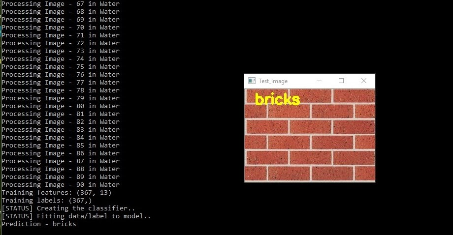
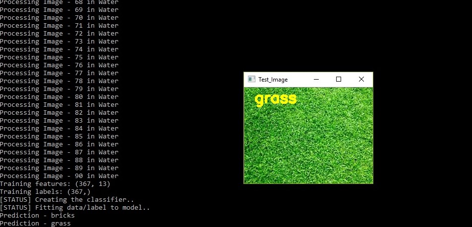
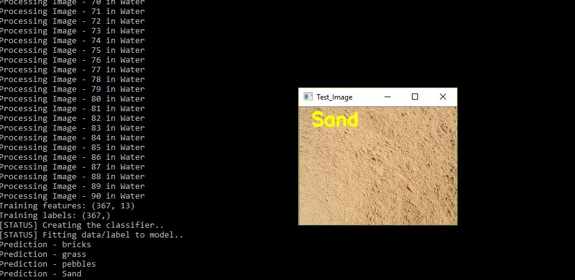
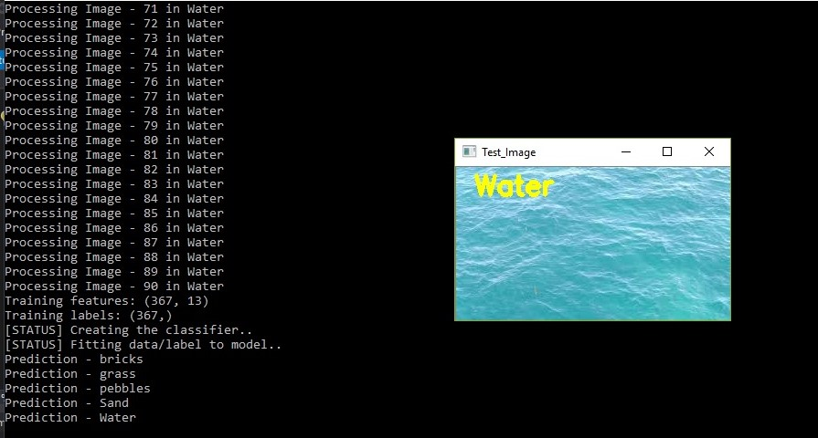

# Object Recognition Texture Features
Object Recognition assumes a vital job in the field of image processing and target based applications

Texture gives us:
1. Spatial arrangement of colours
2. Intensities out of an image.

With the end goal to distinguish an object we should have its highlights as an element vector. This can be accomplished by feature extraction. There are different methods for extracting features of a picture. It tends to be founded on shading, texture or shape. The point of this paper is to study and think about the diverse texture based methodologies for object recognition and feature extraction. GLCM and Haar wavelet change are the most crude strategies for surface investigation.

The items that will be perceived in this task are :
Pebbles, bricks, grass, sand, water.

The project will utilize 'Random Forest Classifier' and 'Haralick Textures' computed utilizing 'GLCM' with the end goal to characterize the articles dependent on their texture features.

# Steps to run this project
(python >= 3.6)

1. Clone this repository
2. Run pip install -r requirements.txt
3. Run Texture_classification.py

# To train on different objects :

1. Inside "Training images" folder, create a folder with the object name and put all the object images within.
2. Inside "Test images" folder, put random images of the same object which is to be recognized.
3. Run Texture_classification.py

# Test on custom images

1. Inside "Test images" folder, put random images of the same object which is to be recognized.
2. Run Texture_classification.py

# Outputs: 

